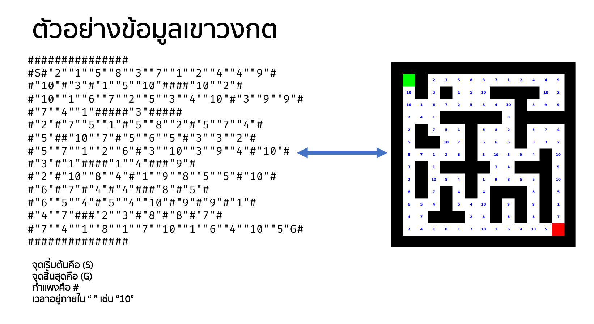

# Maze-Runner

A Java Swing application that solves weighted mazes and **compares search algorithms side by side**.

This project was built for **CPE231 Algorithms** at KMUTT (King Mongkut's University of Technology Thonburi). The goal is to compare classic shortest-path search against genetic-algorithm approaches on the same maze puzzles: how good is the resulting path, how many cells did each method have to explore, and how long did it take?

---

## Algorithms

| Algorithm | Strategy | Cost model | Notes |
| --- | --- | --- | --- |
| **Dijkstra** | Priority queue by accumulated cost, finalized via a `visited` set | Weighted (uses each cell's weight) | Optimal for the non-negative cell weights used here |
| **A\*** | Priority queue by `cost + Manhattan distance to goal` | Weighted | Same shape as Dijkstra with a heuristic; optimality is only guaranteed when the heuristic does not overestimate, which can be violated on cells with weight > 1 |
| **BFS** | Breadth-first search over the 4-connected grid | Unweighted (weights ignored) | Finds the fewest *steps*, not the cheapest weighted route |
| **Genetic** | Genetic algorithm over move-sequence genomes | Weighted | Goal-guided hybrid: fitness includes a BFS distance-to-goal map, genomes are partly seeded with directed moves, and elites/children get greedy repair |
| **PureGA** | Same GA skeleton with **no** guidance | Weighted | Genome moves are purely random — no distance map, no repair, no directed mutation. Slower and less reliable, included as the "raw GA" baseline |

Search direction is 4-way (up/right/down/left). The cost of a move is the weight of the cell being entered.

---

## Requirements

- **JDK 17 or newer** (a JDK is required — the `javac` compiler, not just the `java` runtime). Verified on OpenJDK 21.
- A graphical desktop session. This is a Swing GUI application and will not run on a headless server without a display.

---

## Build and run

Run all commands **from the project root** (the folder containing `MAZE/` and `src/`). Maze files are loaded through relative paths such as `./MAZE/m15_15.txt`, so starting the program from another directory will fail to find them.

### Windows

```cmd
run.bat
```

### Linux / macOS / Git Bash

```bash
javac -d bin -sourcepath src src/th/ac/kmutt/cpe/algorithm/maze/Main.java
java -cp bin th.ac.kmutt.cpe.algorithm.maze.Main
```

The compiled classes land in `bin/` and the compiled output can be deleted at any time to force a clean rebuild:

```bash
rm -rf bin
```

> **Note:** `run.sh` compiles with the glob `maze/**/*.java`. Without bash's `globstar` option enabled, `**` acts as a single `*`, so `Main.java` is never passed to `javac` and the subsequent `java ...Main` can fail with "Could not find or load main class". Prefer the explicit commands above, or enable `shopt -s globstar` first.

---

## Tests

```bash
./run-tests.sh
```

Headless tests for the solvers, with **no dependencies and no build system** — just a
JDK. The script compiles the application plus the test into `bin-test/` and runs it with
`-Djava.awt.headless=true`, so no display is needed. It exits non-zero if anything fails.

Run it from the project root, since mazes are loaded by relative path. The suite checks
exact result snapshots for every algorithm on every bundled maze, verifies that each
solved route really connects the entrance to the exit, cross-checks the algorithms against
each other, and smoke-tests the randomized `PureGA` under a time limit.

The solvers only run without a display because they no longer reference the Swing window;
see `refactor.md` for the details of that change.

---

## Using the application

The window opens with the maze from `MAZE/m15_15.txt` loaded (configurable — see below).

| Control | Purpose |
| --- | --- |
| **Algorithm** | Choose `PureGA`, `Genetic`, `Dijkstra`, `A*`, or `BFS` |
| **Import Maze...** | Load any maze `.txt` file at runtime. Both maze formats below are supported |
| **Run** | Solve the current maze with the selected algorithm |
| **Reset** | Clear explored/path/result markings and interrupt the current run |
| **Speed** | Delay in milliseconds between animation steps. Lower = faster |
| **GA Pop / Gen / Mut% / GoalBias% / Elitism Count** | Genetic algorithm parameters: population size, generation budget, per-gene mutation probability, how often a move is overridden with a goal-directed one, and how many top individuals survive each generation |

### Reading the display

- **Blue** = wall, **white** = open road, **yellow** = currently being explored, **red** = final solved route
- `S` marks the entrance, `G` marks the exit
- Numbers on open cells are that cell's traversal weight

### Metrics

| Metric | Meaning |
| --- | --- |
| **Cost** | Total weighted cost of the solved route. Always ≥ the number of steps, since every cell costs at least 1 |
| **Steps** | Number of cells on the solved route, including the entrance |
| **Visited** | Number of cells the algorithm expanded while searching — the main efficiency comparison. A lower value means less work for the same route |
| **Time** | Wall-clock solve time in milliseconds |

Because the animation sleeps between cells, **Time** includes the Speed slider delay. Set a low delay to compare algorithms on their actual computational cost.

### Choosing a maze

Either use **Import Maze...**, or change the constant near the top of `Main.java` and rebuild:

```java
private static final String FILE_NAME = "./MAZE/m15_15.txt";
```

Included mazes range from 15×15 up to 100×100:

```
m15_15   m24_20   m30_30   m33_35   m40_40   m40_45   m45_45
m50_50   m60_60   m70_60   m80_50   m100_90  m100_100
```

Start with a small maze — `PureGA` can take a long time on the larger ones, since an unguided random search has to stumble onto the exit.

---

## Maze file format

### Weighted format (used by all files in `MAZE/`)

No header. Each cell is exactly one token, written as raw characters:

- `#` — wall
- `S` — entrance
- `G` — exit
- `"n"` — an open road cell with traversal weight `n` (quoted, and the weight may be multi-digit, e.g. `"10"`)

Example (7 columns, 5 rows — entrance `S` upper-left, exit `G` lower-right):

```
#######
#S"2""1""3""4"#
#"2"###"1"#
#"4""1""3"#"2"G
#######
```

Real lines from `MAZE/m24_20.txt` look like this:

```
#S"10""4""8""7"#"1""3""2""5""8""2""7""9""10""7""5""3""4""9""6""8""3"#
```

Cells must be written with no separators — every character either starts a token (`#`, `S`, `G`, `"`) or is ignored. Inserting spaces between cells will shift the columns, so the row will not line up with the rest of the maze.

### Legacy format

The first line contains the size as `N M`, followed by `N` lines of raw characters (`#` for walls, spaces for roads). The entrance is the first open cell on the left edge and the exit the first open cell on the right edge. Weights are generated pseudo-randomly in the range 1–9 using a fixed seed, so runs on the same file are reproducible.

---

## Project structure

```
src/th/ac/kmutt/cpe/algorithm/maze/
├── Main.java                    Entry point: loads the maze, builds the window,
│                                wires up control callbacks and the solver thread
├── structure/                   data + nodes, no UI knowledge at all
│   ├── MazeData.java            Loads either file format and holds grid state:
│   │                            maze, path, visited, result, weight, entrance/exit
│   ├── PathNode.java            Interface shared by both node types: x, y, prev
│   ├── Node.java                Priority-queue node with cost, for Dijkstra and A*
│   └── Position.java            Plain (x, y, prev) node, for BFS and the GAs
├── method/                      the algorithms; depends on the interfaces only
│   ├── SolverListener.java      What a solver needs from outside: render, metrics, pause
│   ├── GeneticSettings.java     The GA parameters, supplied by the UI
│   ├── AbstractSolver.java      Shared: data, listener, DIRECTIONS, animateStep,
│   │                            markPath, resetState
│   ├── AbstractGeneticAlgorithm.java  Helpers the two GAs both need
│   ├── Run.java                 Clears state and dispatches to the selected algorithm
│   ├── Dijkstra.java            Weighted Dijkstra
│   ├── AStar.java               A* with a Manhattan heuristic
│   ├── BFS.java                 Unweighted breadth-first search
│   ├── GeneticAlgorithm.java    Goal-guided genetic algorithm
│   └── PureGA.java              Unguided genetic algorithm baseline
└── ui/
    ├── MazeFrame.java           Swing window: controls, metrics labels, canvas rendering.
    │                            Implements SolverListener + GeneticSettings
    └── MazeUtil.java            Drawing helpers and the animation pause

test/th/ac/kmutt/cpe/algorithm/maze/test/
└── SolverTest.java              Headless tests, run by ./run-tests.sh
```

### How a run works

1. A button click on the window is forwarded to `Main` through the `MazeFrame.ControlListener` interface.
2. `Main` disables the controls and runs the solve on a background thread so the UI stays responsive.
3. `Run.runWithAlgorithm` clears the `visited`, `path`, and `result` grids, builds a solver for the chosen algorithm, and calls `solve()`.
4. The algorithm explores, animating progress through `AbstractSolver.animateStep(...)`, which marks the cell, asks the listener to repaint, and pauses for the current speed setting.
5. On success it backtracks via the nodes' `prev` pointers, marks the final route in `result`, and reports metrics through the listener.

The solvers talk to `SolverListener` rather than to the window, which is what lets the
tests run the same algorithms headlessly.



---

## Known limitations

- `MazeFrame.paint` draws the `S` and `G` labels using swapped row/column accessors, so on non-square mazes the goal marker may not appear. The algorithms themselves locate the entrance and exit correctly.
- `Reset` interrupts the running thread, but that interruption is never propagated into the algorithms, so an in-progress solve is not actually terminated. (The old per-solver `cancelled` fields were removed for this reason: they were never assigned anywhere, and keeping them implied a cancellation mechanism that did not exist.)
- `PureGA` has no generation cap before it reaches the goal, so it does not terminate on a maze with no solution.
- Metrics are updated from the solver thread. Swing is not thread-safe, so occasional visual glitches are possible.
- `AStar` uses a Manhattan-distance heuristic that ignores cell weights. Since weights can exceed 1, the heuristic can overestimate the remaining cost, so A\* may return a route that is not the cheapest one. `Dijkstra` on the same maze is the reliable reference for the true minimum weighted cost.

See `refactor.md` for the full list of known issues, what was refactored, and what was
deliberately left alone.
